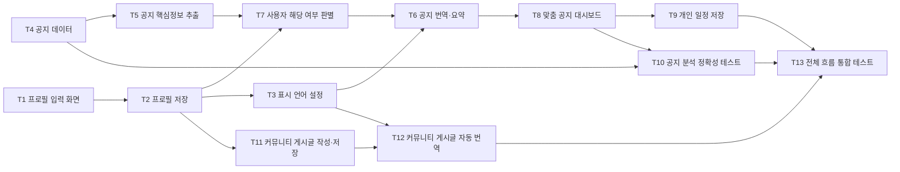

# 5주차 활동지 / Week 5 Worksheet

**1-page 기획서 / One-page plan**

- 작성일 / Date: 260930
- 참여자 / Present: 강수연 김용태 송선우 이재림

---

## ① 주제 확정 / Confirm topic

- 확정 주제 / Topic: 외국인 유학생 맞춤형 학사 및 생활 지원
- 이유 / Reason: 유학생은 언어와 행정문화의 차이로 학교 공지의 의미와 맥락을 정확히 이해하기 어렵습니다. 번역기를 사용해도 대상, 마감일, 제출서류와 처리 절차를 파악하기 어려우며, 비자와 생활정보도 여러 곳에 흩어져 있습니다. 이에 단순히 정보를 번역하는 것을 넘어, "공지를 읽었지만 무엇을 해야 할지 모르는 것"을 해결하는 것에 가치 있다고 판단해 이 주제를 선택하였습니다.

---

## ② 태스크 분해와 의존 관계 / Tasks and dependencies

### 태스크 목록 / Task list

4주차 사용자 스토리와 완료 조건을 태스크로 나눕니다.
*Break down your Week 4 user stories and acceptance criteria into tasks.*

각 태스크는 따로 끝내도 맞는지 확인할 수 있어야 합니다. 담당에 '다 같이'는 쓰지 않습니다.
*Each task must be checkable on its own. Do not write "everyone" as owner.*

| # | 태스크 Task | 완료 조건 Done when | 선행 태스크 Depends on | 담당 Owner |
|---|---|---|---|---|
| T1 | 프로필 입력 화면 구현 | 국적·비자·학위과정·학년·거주 형태 입력란이 표시되고, 필수항목을 입력하지 않으면 안내 문구가 표시된다. | 없음 | 송선우 |
| T2 | 프로필 저장 기능 구현 | 프로필을 저장한 뒤 화면을 다시 열거나 재로그인해도 입력한 정보가 유지된다. | T1 | 김용태 |
| T3 | 서비스 표시 언어 설정 | 한국어·영어·중국어 중 선택한 언어로 화면이 표시되고, 재접속해도 설정이 유지된다. | T2 | 송선우 |
| T4 | 테스트용 공지 데이터 작성 | 수강·장학금·기숙사·비자·행사 공지 10개를 수집하고, 각 공지의 카테고리·대상·마감·행동·제출서류 정답을 작성한다. | 없음 | 강수연 |
| T5 | 공지 핵심정보 추출 | 공지를 입력하면 카테고리·대상·마감일·해야 할 일·제출서류가 JSON 형태로 출력된다. | T4 | 이재림 |
| T6 | 공지 번역 및 요약 | 공지의 핵심 내용이 사용자가 선택한 언어로 표시되고, 번역문과 원문을 모두 확인할 수 있다. | T3, T5 | 이재림 |
| T7 | 사용자 해당 여부 판별 | 국적·비자·학위과정 등이 다른 가상 사용자에게 서로 다른 공지 목록과 해당 이유가 표시된다. | T2, T5 | 김용태 |
| T8 | 맞춤 공지 대시보드 구현 | 테스트 계정으로 로그인하면 사용자 조건에 해당하는 공지만 표시된다. 마감일이 있는 공지는 가까운 순으로 정렬되고, 마감일이 없는 공지는 ‘마감일 없음’ 영역에 별도로 표시된다. | T6, T7 | 송선우 |
| T9 | 개인 일정 저장 기능 구현 | 공지의 마감일과 해야 할 일을 저장하면 개인 일정에 표시되고, 같은 공지가 중복 저장되지 않는다. | T8 | 송선우 |
| T10 | 공지 분석 정확성 테스트 | 공지 10개 중 8개 이상에서 카테고리·대상·마감일·행동·제출서류가 정답 데이터와 일치한다. | T4, T8 | 강수연 |
| T11 | 커뮤니티 게시글 작성 및 저장 | 한국어·영어·중국어로 게시글을 작성하면 작성자·작성 언어·작성시간과 함께 목록에 표시된다. | T2 | 김용태 |
| T12 | 커뮤니티 게시글 자동 번역 | 게시글이 사용자의 설정 언어로 표시되고, 원문과 번역문을 전환하여 확인할 수 있다. | T3, T11 | 이재림 |
| T13 | 전체 흐름 통합 테스트 | 프로필 입력→맞춤 공지 확인→일정 저장과 게시글 작성→번역 확인 과정이 중단 없이 작동한다. | T9, T10, T12 | 강수연 |

### 의존 관계 그래프 / Dependency graph (DAG)

화살표는 "앞 태스크가 끝나야 뒤 태스크를 할 수 있다"는 뜻입니다.
*An arrow means the first task must finish before the second can start.*

**그리는 방법 / How to draw**
- 아래 예시에서 상자 이름을 바꾸고, 선후 관계 하나마다 화살표(`-->`) 줄을 하나씩 추가합니다. GitHub에서 파일을 열면 그림으로 보입니다. 미리 보려면 mermaid.live에 붙여 넣으세요.
  *Rename the boxes and add one `-->` line per dependency. GitHub shows it as a diagram. Preview at mermaid.live.*
- 태스크 표를 AI에게 주고 "Mermaid 그래프로 바꿔 줘"라고 요청해도 됩니다.
  *You can also give the task table to AI and ask "Convert this into a Mermaid graph."*
- 어려우면 종이에 그려 사진을 `docs/images/`에 올리고 ``로 넣어도 됩니다.
  *Or draw it on paper, upload the photo to `docs/images/` and link it with ``.*

- 지금 착수 가능 (진입 차수 0) / Can start now (in-degree 0): 
- 작업 순서 (위상정렬) / Work order (topological sort): 
- 사이클이 있었다면 어떻게 풀었는가 / If there was a cycle, how did you fix it?: 

---

## ③ 범위 결정 / Scope

### Must — 없으면 성립 안 됨 / essential

핵심 시나리오 1개가 끝까지 동작하는 데 필요한 것만 / *Only what the core scenario needs to work end-to-end*

- 유학생이 학교 공지 내용을 입력할 수 있다.
- 공지를 수업·장학금·기숙사·비자·행사 등으로 분류한다.
- 공지에서 대상자, 마감일, 해야 할 일, 제출서류를 추출한다.
- 어려운 행정 표현을 유학생이 이해하기 쉬운 언어로 요약·번역한다.
- 사용자 정보에 따라 해당 공지가 자신에게 필요한지 보여준다.
- 유학생이 자신의 정보와 학교 공지를 입력하면, 공지의 대상·마감일·해야 할 일·제출서류를 이해하기 쉬운 형태로 확인한다.

### Should (없을 경우에는 작성하지 마세요)
 
- 공지의 마감일을 개인 일정에 저장한다.
- 비자 유형에 맞는 준비서류와 행정 절차를 안내한다.
- 학교 주변 음식점·병원 등의 생활정보를 카테고리별로 제공한다.
- 확인했던 공지와 저장한 일정을 다시 볼 수 있다.
- 모든 정보에 원문 링크와 확인 날짜를 표시한다.

### Could (없을 경우에는 작성하지 마세요)

- 내·외국인 학생이 질문과 생활정보를 공유하는 커뮤니티
- 게시글과 댓글의 자동 번역
- 식이 제한이나 진료 가능 언어에 따른 장소 추천
- 마감일 푸시 알림
- 지도 API를 활용한 주변 시설 위치 표시

### **Won't — 이번 학기에 안 함 / not this semester**

| Won't 항목 Item | 포기한 이유 Why |
|---|---|
| 모든 언어 지원 | 번역 품질을 충분히 검증하기 어려워 초기에는 한국어, 영어, 중국어에 집중함 |
| 실시간 채팅 | 핵심 기능 구현에 비해 개발 부담이 큼 |

### 실행 가능성 확인 / Feasibility check

- 특수 장비·유료 API·실제 개인정보가 필요한가? 필요하다면 대안은?
  *Does it need special hardware, paid APIs or real personal data? If so, what is the alternative?*
    - 별도의 특수 장비는 필요하지 않으며, 웹 브라우저에서 실행되는 서비스로 구현할 수 있다.
    - 과목 공지는 Canvas API를 통해 사용자가 수강 중인 과목의 공지 데이터를 가져온다. 이를 위해 Canvas 접근 권한과 API 토큰이 필요할 수 있으므로, 개발 초기에 실제 데이터 조회 가능 여부와 응답 형식을 먼저 확인한다.
    - 학교 공지는 한양대학교 본부 및 단과대별 공지 사이트의 공개 게시물을 크롤링하여 수집한다. 초기에는 모든 단과대가 아니라 팀원이 속한 단과대 등 1~2개 사이트만 대상으로 구현하고, 이후 범위를 확장한다.
    - 사이트마다 게시판 구조가 다르거나 개편될 수 있으므로, 게시판별 수집 모듈을 분리하고 제목·본문·작성일·원문 링크·첨부파일 링크를 공통 형식으로 저장한다.
- 15주차에 발표장에서 시연할 수 있는 형태인가?
  *Can it be demonstrated live in Week 15?*
    - 가능하다. 실제 개인정보 대신 조건이 다른 가상 유학생 계정과 테스트용 공지 데이터를 사용하여 발표장에서 전체 흐름을 시연할 수 있다.
    - 가상 유학생이 로그인하면 프로필에 따라 서로 다른 맞춤 공지가 표시되고, 공지의 대상·마감일·해야 할 일·제출서류와 선택한 언어의 번역·요약 결과를 확인할 수 있다.
    - 공지의 마감일을 개인 일정에 저장하는 기능과, 중국어·영어 등으로 작성된 커뮤니티 게시글이 사용자의 설정 언어로 자동 번역되는 기능도 함께 시연할 수 있다.
    - 외부 API나 크롤링에 문제가 발생하는 상황에 대비하여 사전에 저장한 테스트 데이터를 사용해 핵심 기능은 인터넷 환경에 크게 의존하지 않고 시연할 수 있도록 한다.
 
- 시연가능성 확인 
  * 가상 유학생 2명(조건이 서로 다름)이 로그인하면, 대시보드에 서로 다른 공지와 마감일정이 표시된다.
  * 카드를 열어 카테고리, 대상, 마감, 해야 할 일, 제출서류, 선호 언어로의 요약을 보여주고 마감일을 개인 일정에 저장한다.
  * 중국어로 쓴 게시글을 올린 뒤, 앱 언어가 한국어인 계정과 영어인 계정으로 바꿔 접속하여 각각 번역된 글을 보여준다.
  * 필수 입력사항을 누락한 상태로 프로필 설정을 종료하려하면, 경고 팝업이 뜨는 것을 보여준다.

---

## ④ 가장 먼저 동작시킬 흐름 (Walking Skeleton) / First end-to-end flow

예 / Example: 과제 ID를 입력하면 → LMS에서 제출 기록을 받아 와서 → 화면에 제출 인원 숫자 하나가 뜬다

> [무엇을 입력하면] → [무엇을 처리해서] → [화면에 무엇이 나온다]

> 가상 유학생이 국적·비자·학위과정·학년을 입력하고 테스트용 학교 공지 원문을 붙여 넣으면 → 시스템이 공지의 카테고리·대상·마감일·해야 할 일·제출서류를 추출하고 사용자 프로필과 비교해서 해당 여부를 판단한 뒤 → 화면에 해당 여부와 이유, 마감일, 해야 할 일, 제출서류 및 이해하기 쉬운 번역·요약을 표시한다.
---

> 수업 종료 시 커밋하세요 / Commit this at the end of class
> `git add docs/week-05.md && git commit -m "docs: 5주차 활동지 작성"`
